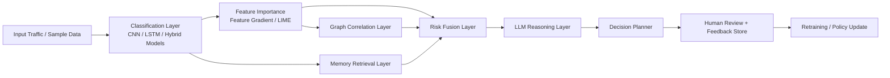

# AI Agentic IDS

A modular, explainable, agentic intrusion-detection repository designed for research demos, GitHub showcase use, and extension into larger security workflows.

## 1. Project Title

**AI Agentic IDS: An Explainable, Multi-Layer Intrusion Detection and Response Pipeline**

## 2. Problem Statement

Traditional intrusion detection systems often stop at classification. They may detect suspicious traffic, but they usually do not explain *why* a sample is risky, connect it to related behavior, reason about the implications, or support decision-making and human review in a structured way.

This project organizes an end-to-end pipeline that:

- classifies network behavior,
- highlights important features,
- correlates attacks with related patterns,
- fuses risk signals,
- generates reasoning,
- recommends actions,
- supports human review and feedback-aware learning.

## 3. Solution Overview

The repository now uses a clean `src/` layout while preserving the existing project logic. The pipeline is organized as layered modules so contributors can understand each stage independently and extend the system without digging through notebooks first.

At a high level:

1. A deep learning model predicts the traffic class.
2. Explainability modules surface influential features.
3. Graph correlation captures relationships between attack patterns.
4. Risk fusion combines confidence, memory, graph, and feature signals.
5. LLM reasoning converts technical outputs into human-readable explanations.
6. A decision planner recommends response actions.
7. Human review, feedback logging, and retraining components close the loop.

## 4. Architecture Diagram



## 5. Key Features

- Clean `src/`-based modular architecture
- Multiple model backbones already preserved in the repo
- Explainability support for feature-gradient and LIME-style interpretation
- Graph-based attack correlation layer
- Adaptive risk fusion module
- LLM-supported reasoning layer with safe fallback summaries
- Decision planning and human-review simulation
- Lightweight demo mode for low-resource environments
- Research-friendly notebooks and comparison scripts retained

## 6. Tech Stack

- Python
- TensorFlow / Keras
- PyTorch
- scikit-learn
- NumPy / pandas
- NetworkX
- Transformers
- FastAPI
- Pydantic
- Matplotlib / Seaborn

## 7. Project Workflow

### Classification Layer

Traffic samples are passed through the existing deep learning classifiers in [`src/models`](/Users/harshitsingh/Developer/Deep_Learning_Project/AI_Agentic_DL/src/models). The repository keeps your CNN, LSTM, GRU, ResNet, Transformer, and Hybrid model code intact.

### Feature Importance (LIME)

Explainability utilities in [`src/utils/explainability`](/Users/harshitsingh/Developer/Deep_Learning_Project/AI_Agentic_DL/src/utils/explainability) provide feature-driven interpretation. In the full pipeline, LIME and feature-gradient style signals are used to explain why a sample was flagged.

### Graph Correlation Layer

[`src/fusion/graph_correlation`](/Users/harshitsingh/Developer/Deep_Learning_Project/AI_Agentic_DL/src/fusion/graph_correlation) builds class-level or sample-level correlations so the system can relate current behavior to previously observed attack patterns.

### Risk Fusion

[`src/fusion/risk_fusion`](/Users/harshitsingh/Developer/Deep_Learning_Project/AI_Agentic_DL/src/fusion/risk_fusion) merges multiple signals such as classifier confidence, memory similarity, graph similarity, and feature importance strength into a single interpretable risk score.

### LLM Reasoning

[`src/reasoning`](/Users/harshitsingh/Developer/Deep_Learning_Project/AI_Agentic_DL/src/reasoning) converts structured outputs into natural-language explanations suitable for demos, reports, or viva presentations.

### Decision Planner

[`src/decision`](/Users/harshitsingh/Developer/Deep_Learning_Project/AI_Agentic_DL/src/decision) maps predictions and risk information to actions such as `No Action`, `Monitor`, `Alert`, or `Block`.

## 8. How It Is Different from Existing Systems

- It is not just a classifier; it is a layered decision pipeline.
- It combines explainability, graph reasoning, memory, and action planning in one repo.
- It includes a human-in-the-loop feedback path rather than stopping at a prediction.
- It is organized to support research experiments and low-resource demos from the same codebase.
- It separates reasoning and decision-making from the core classifier, making the system easier to extend.

## 9. Installation Steps

```bash
git clone <your-repo-url>
cd AI_Agentic_DL
python3 -m venv venv
source venv/bin/activate
pip install -r requirements.txt
```

If your environment exposes `python` instead of `python3`, use:

```bash
python -m venv venv
python -m pip install -r requirements.txt
```

## 10. How to Run

### Default lightweight demo

```bash
python main.py
```

or explicitly:

```bash
python main.py --mode demo
```

### Full pipeline with prepared artifacts

```bash
python main.py --mode full --processed-path data/processed --model-path saved_models/ids_model.keras
```

### Alternative helper scripts

```bash
python scripts/run_demo.py
python scripts/run_pipeline.py
```

## 11. Sample Output Explanation

The demo writes a JSON summary to:

[`data/sample/demo_pipeline_summary.json`](/Users/harshitsingh/Developer/Deep_Learning_Project/AI_Agentic_DL/data/sample/demo_pipeline_summary.json)

Each record includes:

- `classification_layer`: predicted class and confidence
- `feature_importance`: top influential features
- `graph_correlation`: correlated classes or fallback similarity context
- `memory_match`: nearest prior memory context
- `risk_fusion`: combined risk score and severity
- `llm_reasoning`: human-readable explanation
- `decision_planner`: suggested action and review trigger
- `human_review`: simulated analyst feedback

## 12. Folder Structure Explanation

```text
AI_Agentic_DL/
├── src/
│   ├── agents/
│   ├── decision/
│   ├── fusion/
│   ├── models/
│   ├── reasoning/
│   └── utils/
├── configs/
├── data/
├── notebooks/
├── scripts/
├── tests/
├── preprocessed_dataset/
├── saved_models/
├── .gitignore
├── LICENSE
├── README.md
├── main.py
├── pipeline.py
└── requirements.txt
```

### `src/agents`

Orchestration, memory, review, feedback, and integration modules.

### `src/models`

Deep learning models and training utilities.

### `src/fusion`

Graph correlation and multi-signal risk fusion logic.

### `src/reasoning`

LLM-driven reasoning and prompt-generation layers.

### `src/decision`

Decision planners and retraining utilities.

### `src/utils`

Shared utilities such as data loading and explainability support.

### `configs`

Runtime settings for the demo and pipeline thresholds.

### `data`

Small sample inputs and generated demo outputs.

### `notebooks`

Research notebooks and comparisons preserved from the original project.

### `scripts`

Convenience scripts for demo and pipeline execution.

### `tests`

Basic smoke coverage for the reorganized entry path.

## 13. Future Improvements

- Add a dedicated `data/processed/` example bundle for full pipeline execution
- Expand automated tests around each pipeline layer
- Add CI for linting, testing, and demo validation
- Introduce typed config loading instead of JSON merging
- Add benchmarking and reproducible experiment reports
- Expose human-review and feedback APIs through a documented service layer

---

## Quick Start Summary

- Use `python main.py` for the lightweight GitHub demo.
- Use `python main.py --mode full ...` when processed arrays and trained weights are available.
- Explore `src/` for production-style code and `notebooks/` for research experiments.
